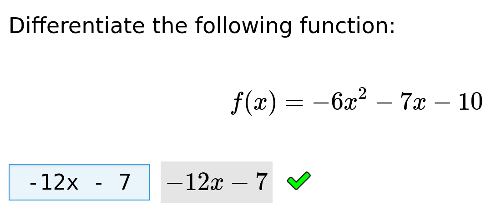
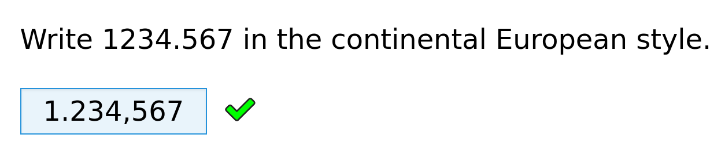
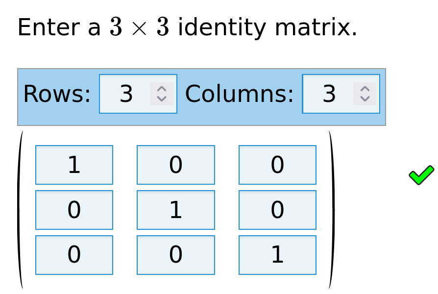
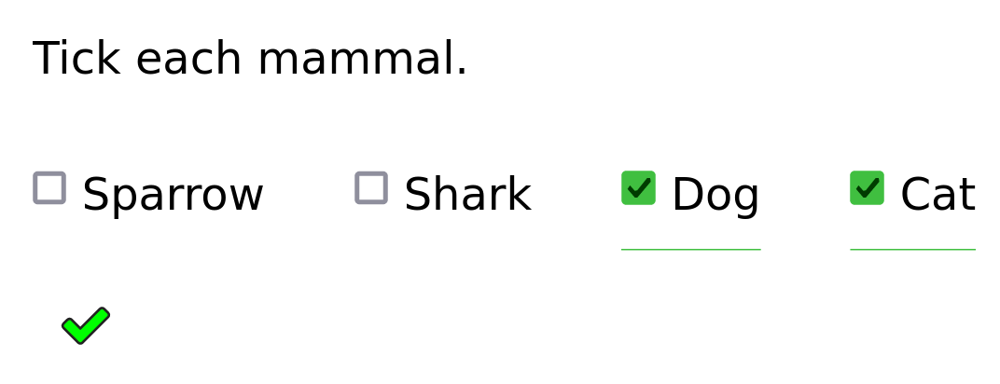
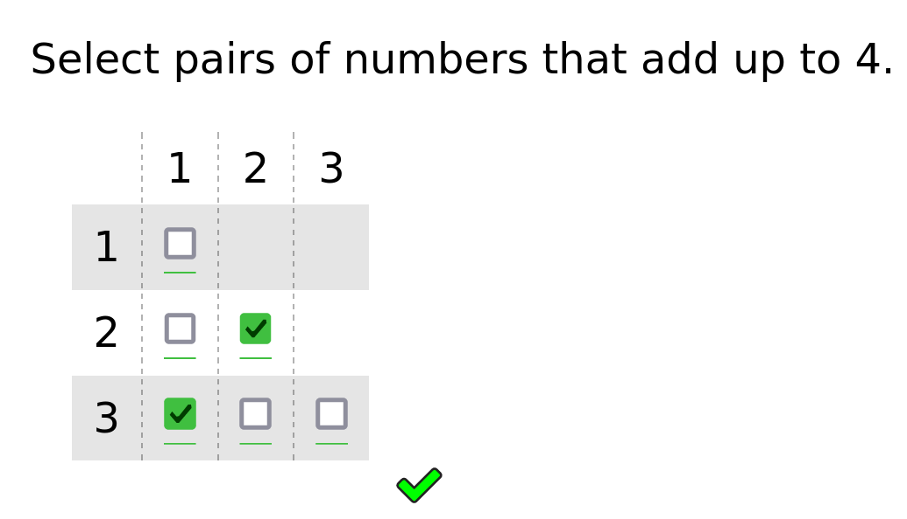
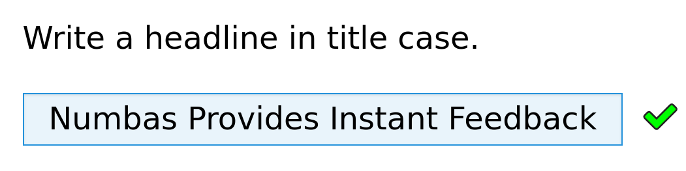
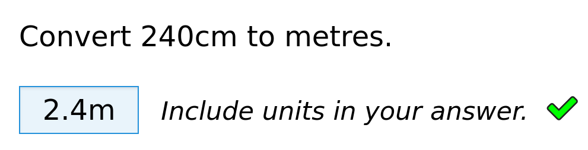
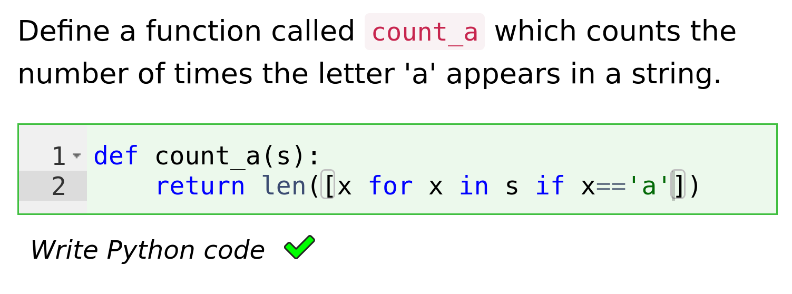
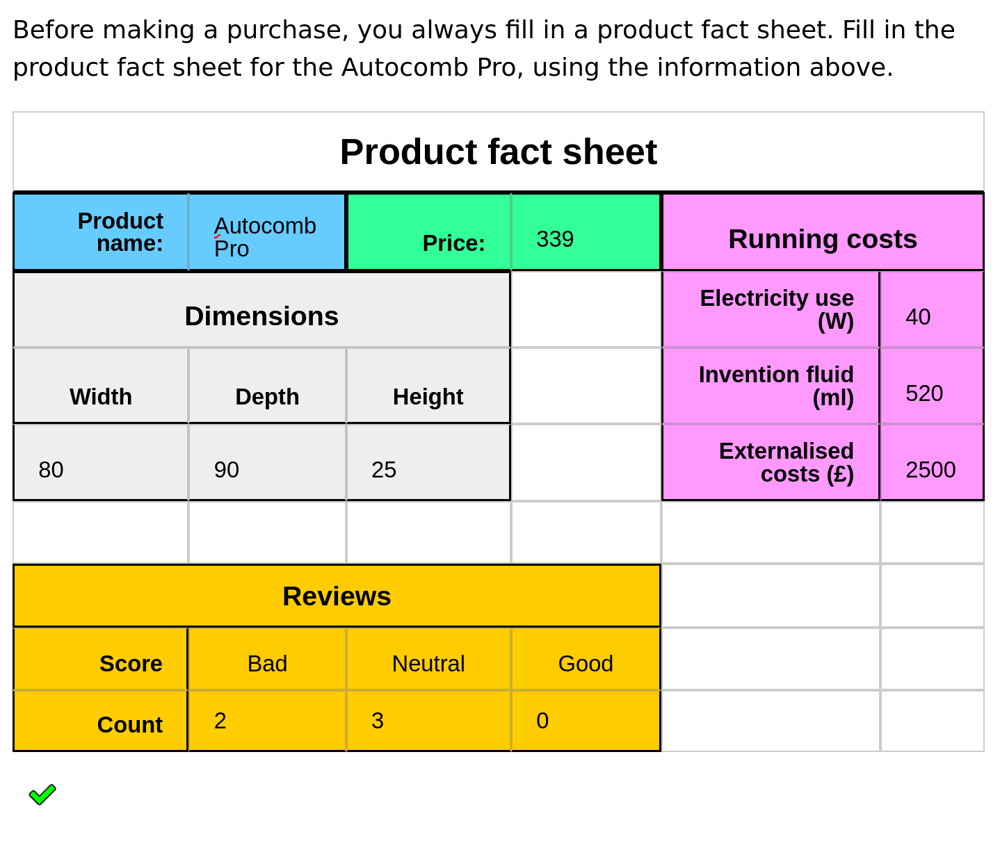

title = "Introduction to Numbas"
presenter = "<a href=\"https://www.staff.ncl.ac.uk/christian.perfect/\">Christian Lawson-Perfect</a>"
affiliation = "Newcastle University"

+++

# 

*  An open-source e-assessment system designed for mathematical subjects.
*  Developed at Newcastle University since 2011.
*  Used around the world.

---

# Key features

*  Randomised questions.
*  Easy to use and accessible.
*  Adaptive behaviour.
*  Customisable everywhere.
*  Lots of maths features.
*  Runs standalone.
*  LTI support.

---

# Question types

<dl class="grid">
    <dt>Math notation</dt>
    <dd></dd>
    <dt>Number</dt>
    <dd></dd>
    <dt>Matrix</dt>
    <dd></dd>
</dl>

---

# Question types

<dl class="grid">
    <dt>Multiple choice</dt>
    <dd>
    </dd>
    <dt>Short text</dt>
    <dd></dd>
    <dt>Make your own</dt>
    <dd></dd>
</dl>

---

# Question types

<dl class="grid">
    <dt>Code</dt>
    <dd>
    <dt>Spreadsheet</dt>
    <dd></dd>
</dl>

---

# Interactive diagrams

<dl class="grid">
    <dt><a href="https://numbas.mathcentre.ac.uk/question/13914/geogebra-test-motion-on-a-slope/">GeoGebra</a></dt>
    <dd><video controls src="videos/geogebra.webm" poster="videos/geogebra.png" alt="A question containing a diagram showing an object on a slope. The play button is clicked, and the object slides down the slope."></video></dd>

    <dt><a href="https://numbas.mathcentre.ac.uk/question/106801/jsxgraph-interactive-venn-diagram/">JSXGraph</a></dt>
    <dd><video controls src="videos/jsxgraph.webm" poster="videos/jsxgraph.png" alt="A question showing a Venn diagram with points labelled by numbers. Below is a table showing the numbers, with checkboxes in columns 'Positive' and 'Even'. The mouse pointer drags some points into the right parts of the diagram, and then clicks on some checkboxes, which causes other points to move to the corresponding positions."></video></dd>
</dl>

---

# Modes of use

<dl>
    <dt>Sequential</dt>
    <dd>A fixed list of questions.</dd>
    <dt>Menu</dt>
    <dd>Student picks which questions they want to try.</dd>
    <dt>Diagnostic</dt>
    <dd>Adapts to student's performance.</dd>
    <dt>Explore</dd>
    <dd>Student picks their own path through an activity.</dd>
</dl>

---

# How we use it

* Large banks of practice material.
* In-course assessment: open for two weeks, worth 2% of module.
* Labs: students enter measurements; Numbas marks calculations.
* High-stakes assessments for many maths modules, as well as large service courses.
* Hybrid exams: some automatically marked, some marked by hand.

---

# How to do it

* Large question-writing team.
* Think creatively about assessing hard topics.
* Check everything very thoroughly *in advance*.

---

<figure>
    <iframe src="https://numbas.mathcentre.ac.uk/exam/1973/numbas-website-demo/embed"></iframe>
    <figcaption><a target="_blank" class="source" href="https://www.numbas.org.uk/demo">numbas.org.uk/demo</a></figcaption>
</figure>

---

# The mathcentre editor

* Open to everyone.
* Collect ready-made questions into a custom test
* Or write your own.

[numbas.mathcentre.ac.uk](https://numbas.mathcentre.ac.uk)

---

# Documentation

<figure>
    
    <figcaption>
        <a href="https://docs.numbas.org.uk">docs.numbas.org.uk</a>
    </figcaption>
</figure>

---

# Thanks!

<dl>
<dt>Website</dt>
<dd><a href="https://www.numbas.org.uk">numbas.org.uk</a></dd>

<dt>Email</dt>
<dd><a href="mailto:numbas@ncl.ac.uk">numbas@ncl.ac.uk</a></dd>

<dt>Fediverse</dt>
<dd><a href="https://mathstodon.xyz/@numbas">@numbas@mathstodon.xyz</a></dd>

<dt>Source code</dt>
<dd><a href="https://github.com/numbas">github.com/numbas</a></dd>
</dl>
