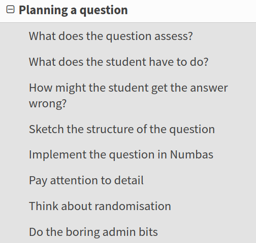

# Plan for today

Numbas is capable of a lot more than I can show in an hour!

* Introduce Numbas and demo
* Find out what's wanted
* Explore the Numbas editor
* Q&A

---

Numbas is an open-source web-based e-assessment tool.

It is aimed at numerate disciplines.

Developed by the e-learning unit in Newcastle University's School of Mathematics, Statistics and Physics.

---

# Key features

* Scalable, reliable and accessible to a broad range of users.
* Easy to use.
* Used by question authors who aren't experts.
* Feedback is important.
* Customisable everywhere.
* Delivered through VLE or standalone.
* Lots of maths features.

---

# Applications of Numbas

At Newcastle, we use Numbas for:

* Formative use in a pre-entry course.
* Diagnostic tests in week 1.
* Banks of practice material to supplement lecture material.
* In-course assessment.
* Lab exercises.
* Final exams.

---

# Subjects using Numbas

* Mathematics and statistics
* Physics
* Engineering
* Chemistry
* Business studies
* Psychology
* Biomedical science
* Sports science
* ... and more

---

# Outside of Newcastle

* 1,500+ institutions in the UK and around the world.
* 8,000+ users registered on public editor.
* 9,500+ questions and exams released for free reuse under an open access licence.

(as of June 2022, as far as we can tell)

---

# A quick demo

[Numbas demo exam](https://numbas.mathcentre.ac.uk/exam/1973/numbas-website-demo/embed/)

---

# The mathcentre editor

* Open to everyone.
* Collect ready-made questions into a custom test
* Or write your own.

[numbas.mathcentre.ac.uk](https://numbas.mathcentre.ac.uk)

---

# [docs.numbas.org.uk](https://docs.numbas.org.uk)

---

# Planning a question

---

# Use projects

---

# Organise material into folders

---

# Use editing history to leave editing comments and set checkpoints

---

# Write good variable descriptions

---

# Use the "random person" extension

---

# Create printable exams with the "printed worksheet" theme

---

# Extensions add functionality

# Custom part types allow different kinds of interaction

---

# Thanks!

Website: [numbas.org.uk](https://www.numbas.org.uk)

Email: [numbas@ncl.ac.uk](mailto:numbas@ncl.ac.uk)

Twitter: [@NclNumbas](https://twitter.com/nclnumbas)

Source code: [github.com/numbas](https://github.com/numbas)

