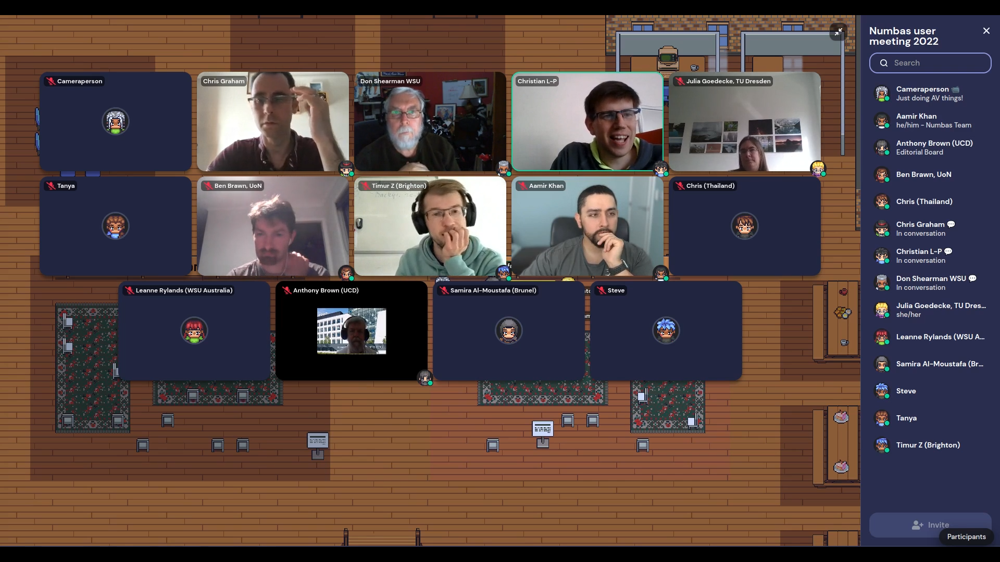
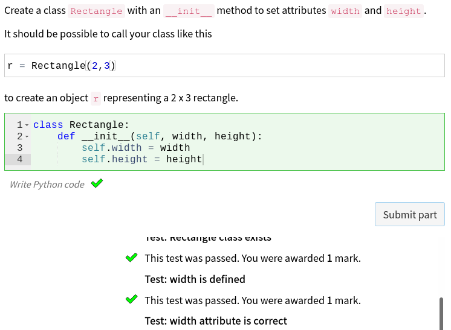
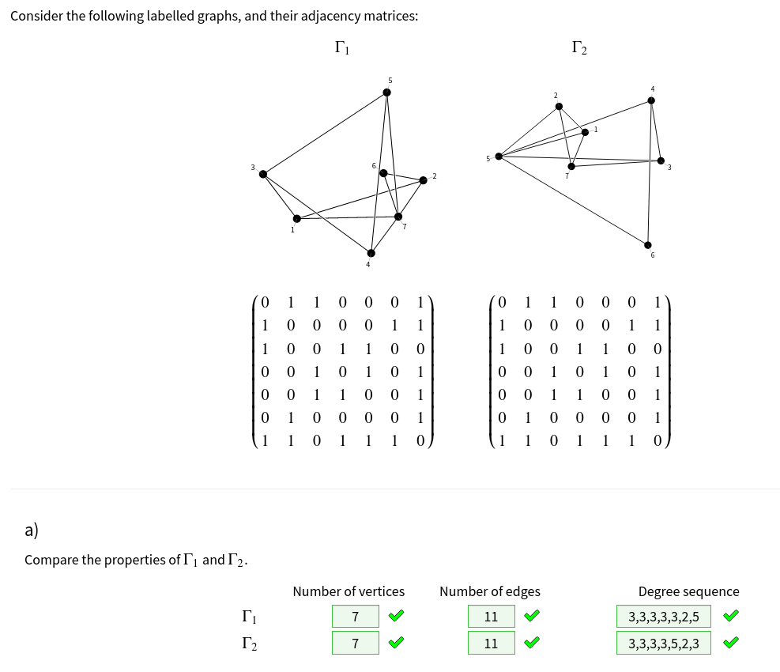
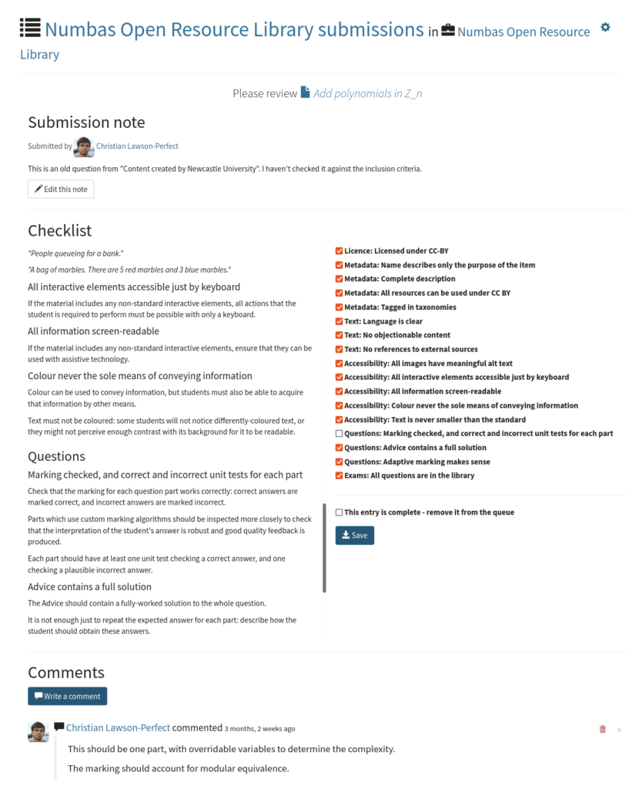
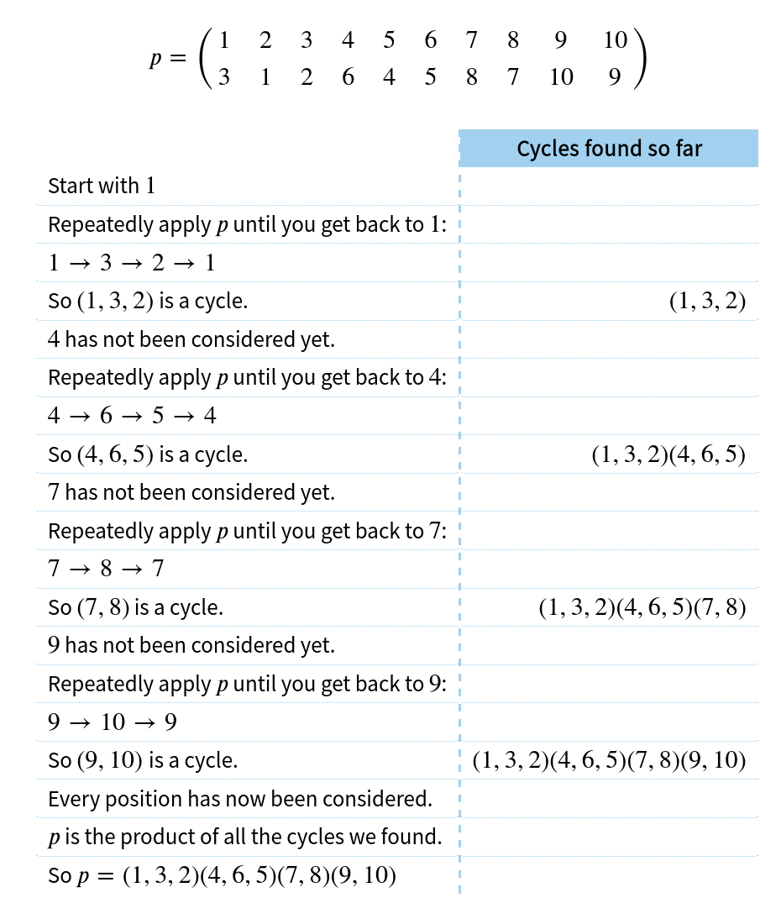
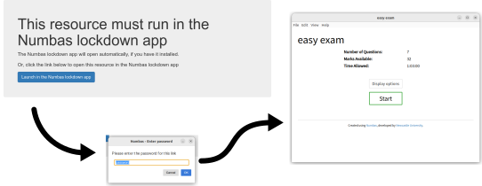

> “In the coming year, I’m going to focus less on developing new features in Numbas, and more on organising the content we’ve already got.”

---

# [numbas.mathcentre.ac.uk/stats](https://numbas.mathcentre.ac.uk/stats/):

* 100,000+ questions
* ~9,500 published items
* ~8,000 users
* ~1,500 institutions

---

# Community stats

* Runtime [translated](https://www.numbas.org.uk/contributing-to-numbas/#numbas-in-your-own-language) to 18 languages (LTI tool only 2!)
* ~ 20 pull requests in the last year
* ~ [A dozen papers mentioning Numbas](https://scholar.google.co.uk/scholar?as_ylo=2021&q=%22numbas%22&hl=en&as_sdt=0,5)

---

# Numbas user meeting

[numbas.org.uk/numbas-user-meeting-spring-2022/](https://www.numbas.org.uk/numbas-user-meeting-spring-2022/)

---

# LTI tool v3.0

* Getting a grip on async tasks!
* [Docker](https://docs.numbas.org.uk/lti/en/latest/installation/docker.html)
* Managing versions better

[numbas.org.uk/blog/2021/11/numbas-lti-provider-v3-0/](https://www.numbas.org.uk/blog/2021/11/numbas-lti-provider-v3-0/)

We're taking on more hosting contracts (talk to us if interested!)

---

# .exam schema

[numbas.org.uk/schema](https://www.numbas.org.uk/schema/)

---

# Numbas Open Resource Library

**Aim:** Collect good, reliable open-access material in a moderated library.

[In progress](https://numbas.mathcentre.ac.uk/project/17986/)

---

# Behind the design of Numbas

[numbas.org.uk/behind-the-design/](https://www.numbas.org.uk/behind-the-design/)

~ 13,000 words so far

---

# Custom input methods

[documentation](https://docs.numbas.org.uk/en/latest/extensions/writing-extensions.html#adding-a-new-answer-input-method)

---

# Pre-submit tasks

[documentation](https://docs.numbas.org.uk/en/latest/marking-algorithm.html#pre-submit-tasks)

---

# [Graph theory](https://www.numbas.org.uk/blog/2022/03/development-update-march-2022/#h-graph-theory-extension)

([demo](https://numbas.mathcentre.ac.uk/exam/27245/graph-theory-questions/preview/))

---

# [Improvements to JSXGraph](https://www.numbas.org.uk/blog/2021/10/improvements-to-the-jsxgraph-extension/)

<video src="images/jsxgraph.mp4" autoplay loop/>

---

# Queues

[documentation](https://docs.numbas.org.uk/en/latest/project/reference.html#queues)

---

---

# Autocompletion in the editor

<video src="images/numbas-editor-autocomplete.mp4" autoplay loop>

---

# Aims for the next year: Producing [working-out](https://www.numbas.org.uk/blog/2022/03/development-update-march-2022/#h-working-out)

---

# Aims for the next year: Lockdown app

---

# Aims for the next year: More contributors!

([177](https://github.com/numbas/Numbas/issues) + [108](https://github.com/numbas/editor/issues) + [81](https://github.com/numbas/numbas-lti-provider/issues) = 366 open issues!)
