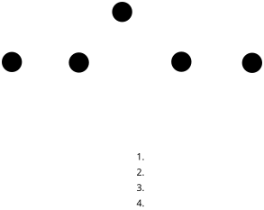
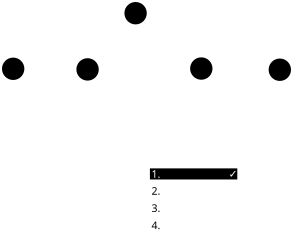
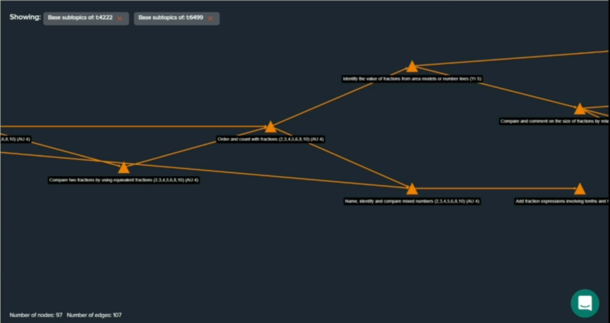

**Goal**: Implement a model of adaptive assessment in Numbas, for:

* diagnostic tests
* assessment for learning

---

## DIAGNOSYS

* A _knowledge graph_ of topics, linked by dependency.
* One question per node on the graph.
* Classify each node as "passed" or "failed".
* After answering a question, mark it and its backward/forward dependencies as passed/failed.
* Learning objectives are subsets of the nodes, e.g. "Algebra", "Calculus".
* Use student's qualifications to estimate starting point.
* Limited "lives" for retrying a question.

---

---

---

---

---

---

---

## "Mastery"

Inspired by Duolingo.

* Roughly linear.
* Each topic has several questions.
* All questions must be answered correctly.
* Failed questions are put back on the end of a queue.

---

---

---

---

---

## Mathspace

[Talk by Mo Jebara at EAMS 2018](https://eams.ncl.ac.uk/archive/2018/sessions/keynote-mo-jebara/)

* Inner loop: immediate question feedback
* Middle loop: pick a question within a topic
* Outer loop: pick a topic

---

---

## Item response theory

* Update P(pass topic) after each answer.
* Stop asking questions when confidence is high.

---

## Another model (Möbius?)

* Estimate student's knowledge level on a linear scale.
* Move up or down based on answers.
* Ask N questions, chosen based on student's level.

---

## Implementation in Numbas

* Exam author defines topics and learning objectives.
* Topics have "depends on" / "leads to" relations.
* One question group per topic.
* Controlled by a _diagnostic algorithm_.
* Some built-in, can extend or write your own.

(See the [documentation](https://docs.numbas.org.uk/en/latest/exam/diagnostic.html))

---

---

---

## Success

I've reimplemented DIAGNOSYS in Numbas.

[numbas.mathcentre.ac.uk/exam/22135/diagnosys](https://numbas.mathcentre.ac.uk/exam/22135/diagnosys/)

---

## Writing an adaptive test is hard

Need to write _lots_ of questions.

Must think hard about model of knowledge, and relations between topics.

---

---

## Partial success!

To do:

* Use DIAGNOSYS on students
* Improve the editing interface: more easily configurable settings
* Implement some other models

**Your input is very welcome!**
