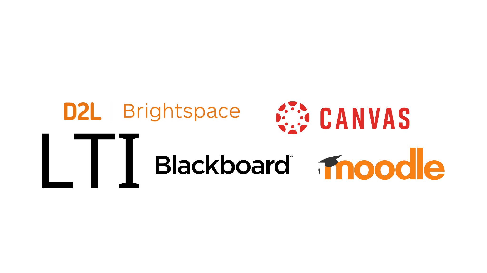
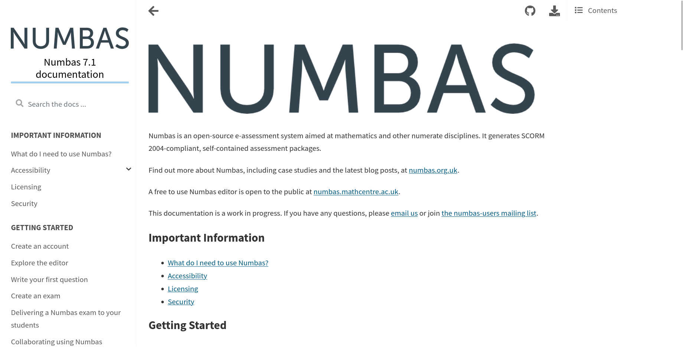
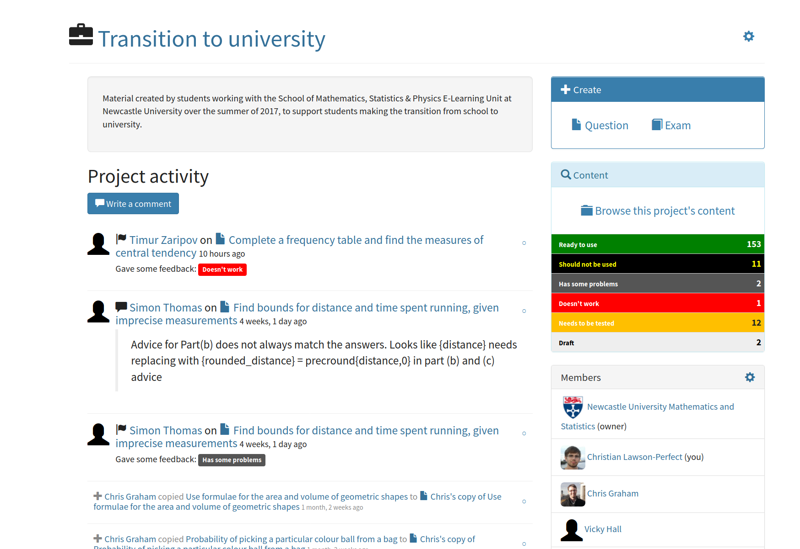
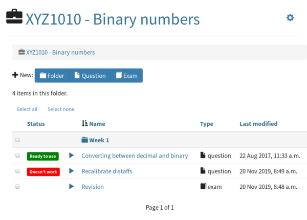
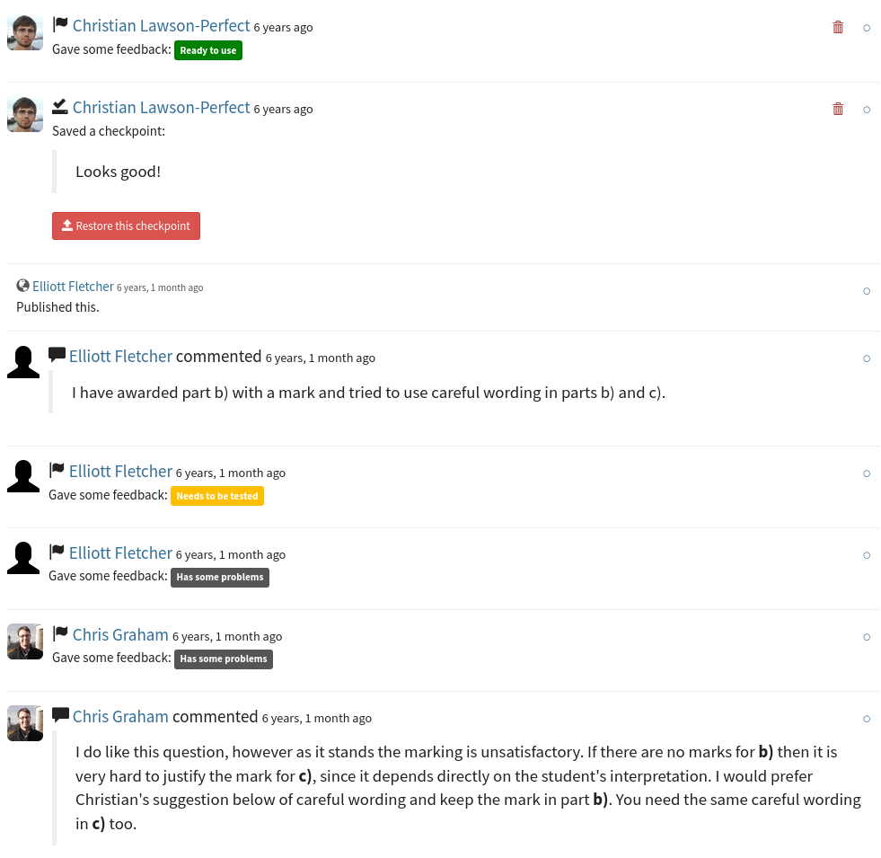
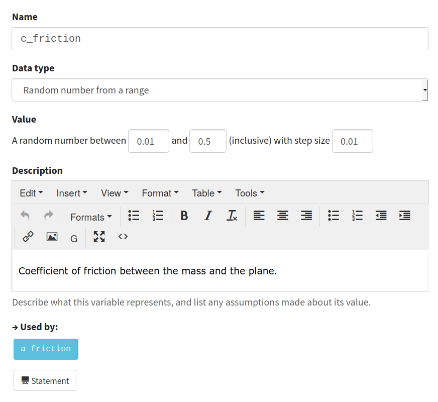
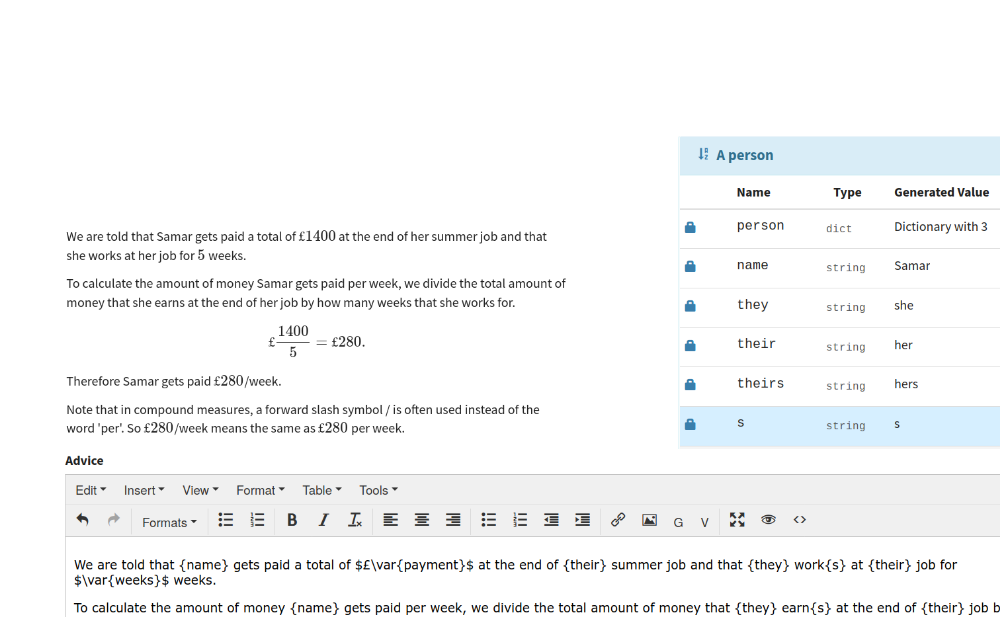
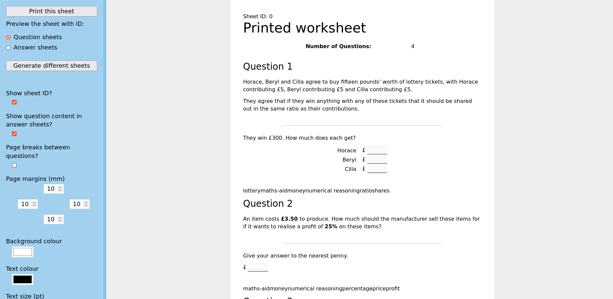
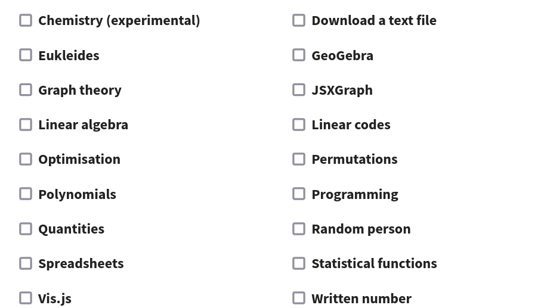
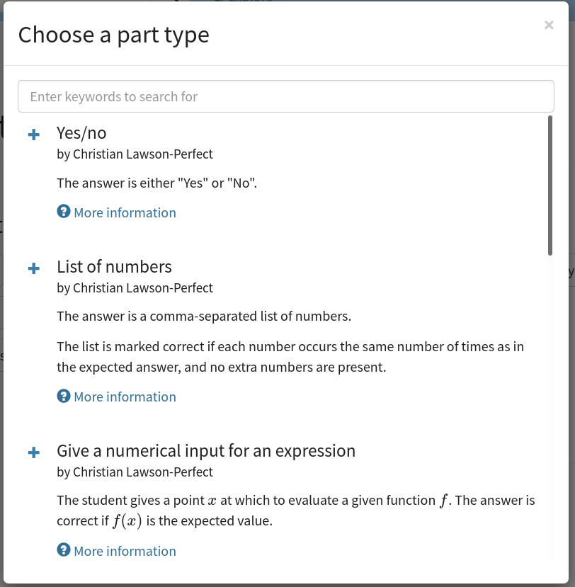

# Plan for today

* Introduce Numbas and demo
* Write a first question
* Look at advanced features

<aside>
around the world
lots of subjects
used for over a decade
students rate
randomisation
explore mode
diagnostic mode
adaptive marking
alternative answers
graphics, videos, interactives
CC material
works offline / client side
automatic immediate marking
translations
lots of maths features
accessibility
LTI, SCORM, standalone
extensions
themes
open source
graphical editor
</aside>

---

---

---

---

---

---

---

---

---

---

---

---

---

# A quick demo

[Numbas demo exam](https://numbas.mathcentre.ac.uk/exam/1973/numbas-website-demo/embed/)

---

# The mathcentre editor

* Open to everyone.
* Collect ready-made questions into a custom test
* Or write your own.

[numbas.mathcentre.ac.uk](https://numbas.mathcentre.ac.uk)

---

# [docs.numbas.org.uk](https://docs.numbas.org.uk)

---

# Planning a question

* What does the question assess?
* What does the student have to do?
* How might the student get the answer wrong?
* Sketch the structure of the question
* Implement the question in Numbas
* Pay attention to detail
* Think about randomisation
* Do the boring admin bits

---

# Use projects

---

# Organise material into folders

---

# Use editing history to leave editing comments and set checkpoints

---

# Write good variable descriptions

---

# Use the "random person" extension

---

# Create printable exams with the "printed worksheet" theme

---

# Extensions add functionality

---

# Custom part types allow different kinds of interaction

---

# Thanks!

<dl>
<dt>Website</dt>
<dd><a href="https://www.numbas.org.uk">numbas.org.uk</a></dd>

<dt>Email</dt>
<dd><a href="mailto:numbas@ncl.ac.uk">numbas@ncl.ac.uk</a></dd>

<dt>Fediverse</dt>
<dd><a href="https://mathstodon.xyz/@numbas">@numbas@mathstodon.xyz</a></dd>

<dt>Source code</dt>
<dd><a href="https://github.com/numbas">github.com/numbas</a></dd>
</dl>
