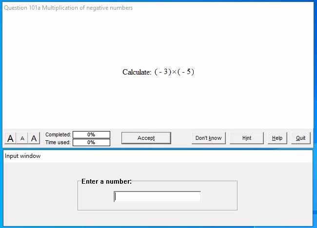
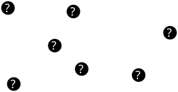
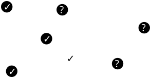
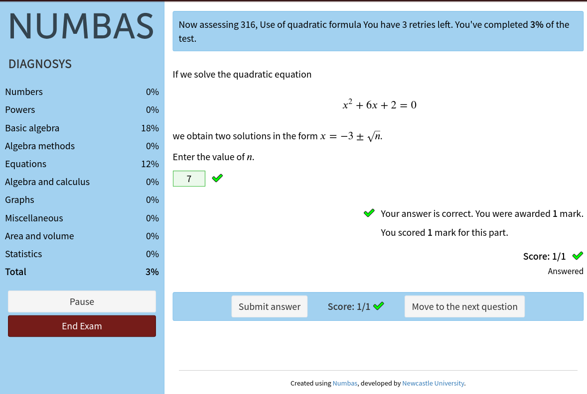
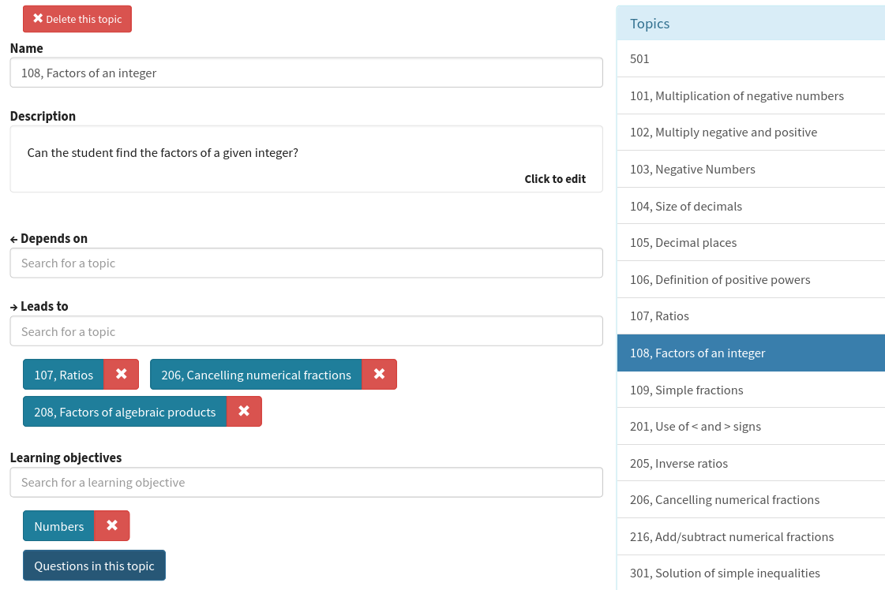

## Goal

Implement a model of adaptive assessment in Numbas, for diagnostic tests

* Efficiently identify weak spots in students' presumed knowledge
* Don't ask questions that are too easy or too hard

---

## DIAGNOSYS

---

## DIAGNOSYS

---

## DIAGNOSYS

---

## DIAGNOSYS

---

## DIAGNOSYS

---

## DIAGNOSYS

---

## DIAGNOSYS

---

## Implementation in Numbas

* Exam author defines topics and learning objectives.
* Controlled by a _diagnostic algorithm_.
* Some built-in, can extend or write your own.

(See the [documentation](https://docs.numbas.org.uk/en/latest/exam/diagnostic.html))

---

---

---

---

## Useful when

You want to test:

* small
* easily-assessed
* hierarchical

pieces of knowledge

---

## Writing an adaptive test is hard

Need to write _lots_ of questions.

Must think hard about model of knowledge, and relations between topics.

---

## Thanks!

* [numbas.org.uk](https://www.numbas.org.uk)
* [numbas@ncl.ac.uk](mailto:numbas@ncl.ac.uk)
